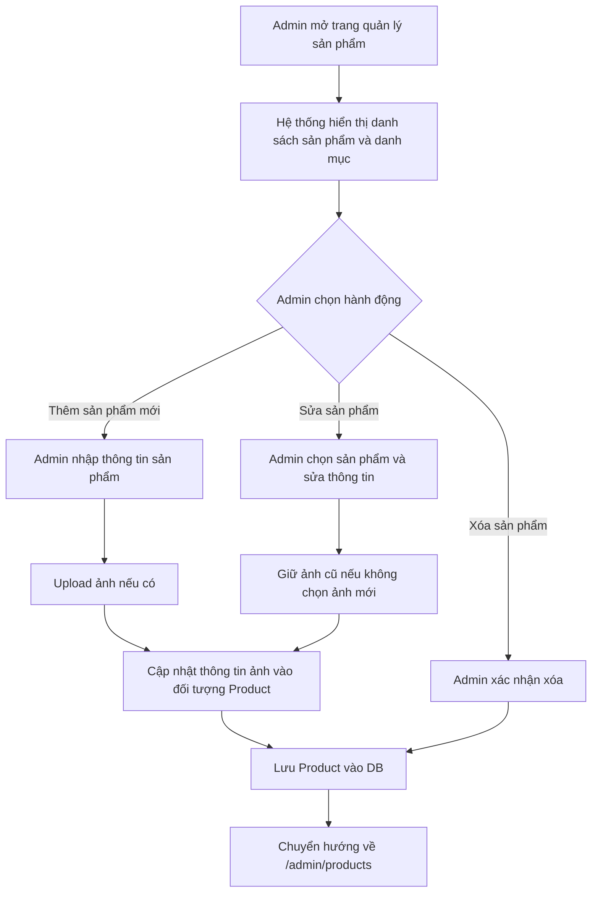
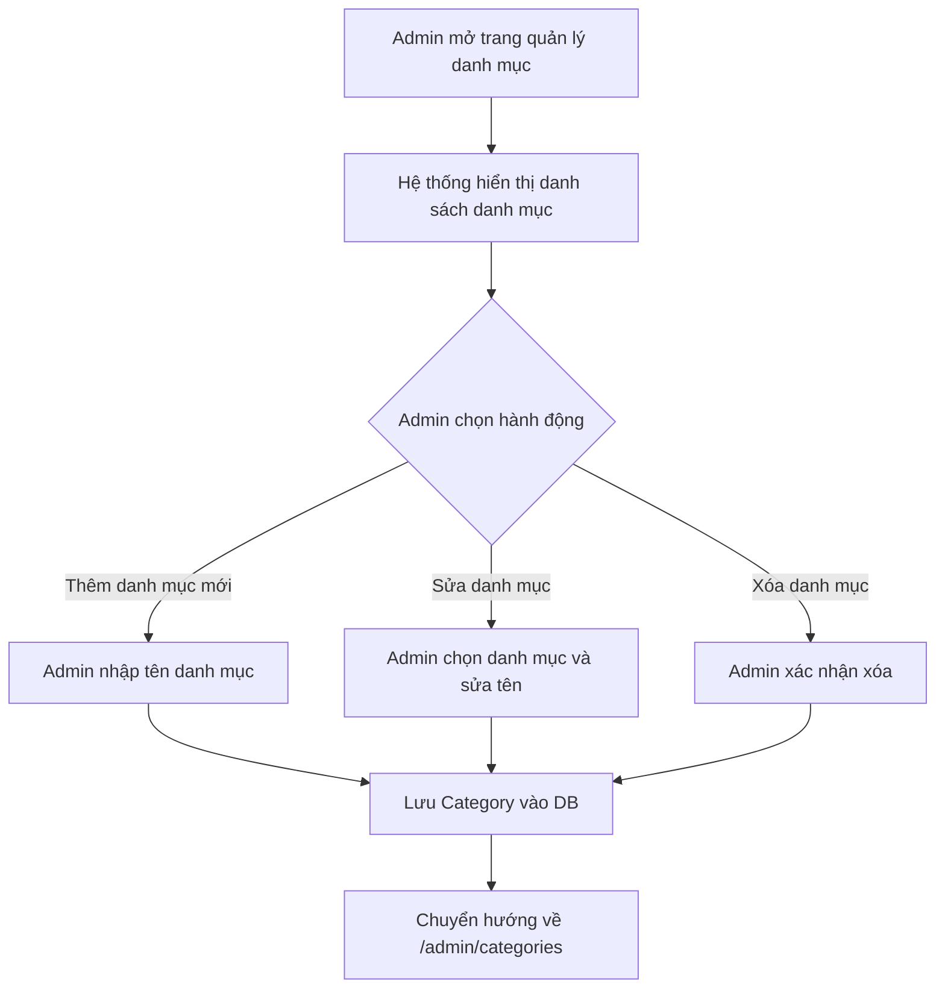
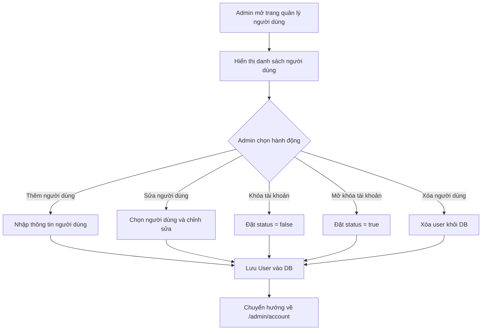
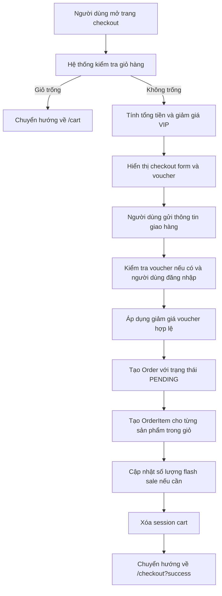

# Activity Diagrams

## 1. Quản lý Sản phẩm


## 2. Quản lý Danh mục


## 3. Quản lý Nhân Viên
```mermaid
flowchart TD
    A[Admin mở trang quản lý nhân viên] --> B[Hiển thị danh sách nhân viên (Người dùng không phải admin)]
    B --> C{Admin chọn hành động}
    C -->|Thêm nhân viên| D[Nhập thông tin nhân viên mới]
    C -->|Sửa nhân viên| E[Chọn nhân viên và chỉnh sửa]
    C -->|Khóa tài khoản| F[Đặt status = false]
    C -->|Mở khóa tài khoản| G[Đặt status = true]
    C -->|Xóa nhân viên| H[Xóa user khỏi DB]
    D --> I[Lưu User vào DB]
    E --> I
    F --> I
    G --> I
    H --> I
    I --> J[Chuyển hướng về /admin/account]
```

## 4. Quản lý Người dùng


## 5. Xem sản phẩm theo loại
```mermaid
flowchart TD
    A[Người dùng mở trang sản phẩm] --> B[Hệ thống hiển thị bộ lọc danh mục, giá, từ khóa]
    B --> C[Người dùng chọn loại sản phẩm (cid)]
    C --> D[Hệ thống gọi productService.searchProducts(cid, min, max, kw)]
    D --> E[Trả về danh sách sản phẩm tương ứng loại]
    E --> F[Hiển thị kết quả trên trang /products]
```

## 6. Giỏ hàng
```mermaid
flowchart TD
    A[Người dùng trên trang sản phẩm] --> B[Click "Thêm vào giỏ hàng"]
    B --> C[Kiểm tra session cart hiện tại]
    C --> D{Sản phẩm đã có trong giỏ?}
    D -->|Có| E[Tăng số lượng tới tối đa 99]
    D -->|Chưa| F[Thêm sản phẩm mới vào giỏ]
    E --> G[Cập nhật session cart]
    F --> G
    G --> H[Chuyển hướng về /cart]

    H --> I[Người dùng xem giỏ hàng]
    I --> J[Hiển thị các mục giỏ, tổng tiền, giảm giá VIP]
    I --> K{Người dùng cập nhật / xóa mục}
    K -->|Cập nhật số lượng| L[Cập nhật quantity trong session cart]
    K -->|Xóa mục| M[Xóa sản phẩm khỏi session cart]
    L --> J
    M --> J
```

## 7. Đặt hàng

