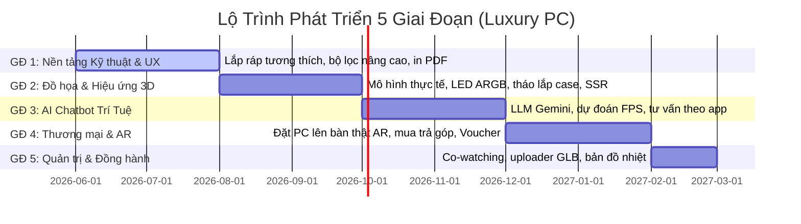

# Lộ Trình Nâng Cấp: Chức Năng Build PC 3D & AI Chatbot
## 5 Giai Đoạn Triển Khai Chi Tiết (50 Tính Năng)

Để triển khai hiệu quả 50 tính năng nâng cấp cho Luxury PC mà không làm quá tải hệ thống, lộ trình được chia thành **5 Giai đoạn phát triển tuần tự**. Mỗi giai đoạn gồm đúng **10 tính năng** tập trung vào một mục tiêu chiến lược cụ thể.

---

---

## 🟢 Giai đoạn 1: Nền Tảng Tương Thích & Trải Nghiệm UX Cốt Lõi
*Mục tiêu: Đảm bảo tính chính xác về mặt kỹ thuật lắp ráp phần cứng và cải thiện tương tác cơ bản mượt mà cho khách hàng.*

1. **Kiểm tra cấn tản nhiệt khí và RAM (RAM-Cooler Clearance Check):** So sánh chiều cao RAM và khoảng hở dưới quạt của tản nhiệt khí để cảnh báo cấn trước khi mua.
2. **Tính toán TDP & Đề xuất Nguồn (Wattage Calculator):** Tự tính tổng công suất tiêu thụ tối đa của các linh kiện đã chọn và đề xuất công suất nguồn (PSU) phù hợp.
3. **Kiểm tra độ dài Card đồ họa (GPU Length Clearance):** Đo độ dài card đồ họa và đối chiếu với kích thước trống tối đa bên trong vỏ case để tránh cấn tản nhiệt nước.
4. **Kiểm tra bus RAM hỗ trợ tối đa:** Cảnh báo nếu chọn RAM Bus cao (ví dụ: 7200MHz) nhưng CPU hoặc Mainboard chỉ hỗ trợ tối đa bus thấp hơn (ví dụ: 6000MHz).
5. **Cảnh báo thiếu Keo tản nhiệt/Phụ kiện lắp đặt:** Nhắc nhở thông minh nếu giỏ hàng của người dùng thiếu các vật tư phụ kiện cơ bản để tự ráp máy.
6. **Bộ lọc linh kiện nâng cao (Advanced Filters):** Lọc theo chiều cao tản, khe cắm RAM, hãng sản xuất, có LED hay không, chuẩn kích thước bo mạch (ITX, ATX).
7. **Tính năng Undo / Redo Actions:** Cho phép quay lại bước lắp ráp trước đó hoặc khôi phục hành động cắm/rút linh kiện dễ dàng.
8. **Phím tắt điều khiển nhanh (Hotkeys Control):** Nhấn phím tắt để bật tắt nguồn PC, xoay linh kiện, hoặc hoàn tác lắp ráp nhanh.
9. **Chế độ màn hình chia đôi (Split View):** Vừa xem danh sách linh kiện dạng lưới vừa điều khiển xoay 3D song song thuận tiện.
10. **In bảng báo giá PDF chuyên nghiệp (Export PDF Quotes):** Xuất file PDF chứa ảnh render PC, bảng giá linh kiện kèm logo sang trọng để gửi khách hàng lưu trữ.

---

## 🔵 Giai đoạn 2: Đồ Họa 3D & Hiệu Ứng Lắp Ráp Chân Thực
*Mục tiêu: Làm đẹp hình ảnh trực quan, tăng tính thẩm mỹ và mô phỏng chính xác cơ học của vỏ case.*

11. **Mô hình 3D thực tế của hãng (High-Fidelity 3D Models):** Thay thế các khối hộp cơ bản bằng mô hình chi tiết định dạng `.gltf`/`.glb` tải từ hãng sản xuất (quạt quay, cánh VGA xoay).
12. **Hiệu ứng LED ARGB động (ARGB Lighting Presets):** Tích hợp hiệu ứng nháy theo nhạc, hiệu ứng sóng màu (color wave), hoặc nhịp thở (breathing) trên linh kiện.
13. **Chế độ phóng to linh kiện (Inspect Mode):** Tự động zoom camera sát và xoay xung quanh linh kiện được click để kiểm tra rõ các cổng kết nối và khe cắm.
14. **Mô phỏng tháo ráp vỏ case bằng tay (Interactive Chassis):** Khách hàng tự tương tác tháo lắp mặt kính cường lực, mặt hông vỏ case trên giao diện web.
15. **Hiệu ứng tháo lắp vật lý (Snap-to-Fit Physics):** Linh kiện tự động hút vào đúng vị trí cắm (khe PCIe, socket CPU) và phát tiếng click cơ học khi khớp.
16. **Render phản chiếu mặt kính thực tế (Screen Space Reflections):** Phản chiếu dải LED RGB lung linh lên bề mặt kính cường lực của vỏ case.
17. **Tương thích nguồn PCIe 5.0 (12VHPWR Cable Check):** Cảnh báo nếu VGA đời mới (RTX 4000) yêu cầu dây nguồn 16-pin chuyên dụng nhưng nguồn được chọn là chuẩn cũ.
18. **Giao diện sáng/tối đồng bộ (Dark/Light Mode):** Hỗ trợ đổi giao diện 3D Configurator sang tone trắng sứ (Sleek White) hoặc tối đen huyền bí (Gold Matrix).
19. **Tiến trình lắp ráp dạng bước (Step-by-Step Wizard):** Hướng dẫn người dùng mới lắp theo thứ tự chuẩn kỹ thuật: CPU -> RAM -> Main -> Case -> Tản -> VGA -> Nguồn.
20. **Chụp ảnh màn hình 4K (Snapshot Mode):** Ẩn toàn bộ nút bấm xung quanh để chụp và lưu ảnh PC render sắc nét nhất.

---

## 🟡 Giai đoạn 3: Chatbot AI Trí Tuệ & Tư Vấn Thông Minh
*Mục tiêu: Nâng cấp chatbot hỗ trợ thành một chuyên viên tư vấn PC thông minh bằng công nghệ AI tạo sinh.*

21. **Tích hợp mô hình ngôn ngữ lớn (Gemini/ChatGPT API):** Giúp chatbot hiểu ngôn ngữ tự nhiên phức tạp của khách hàng thay vì chỉ quét từ khóa tĩnh.
22. **Tự tối ưu hóa hiệu năng/giá tiền (Cost-Performance Optimizer):** AI đề xuất linh kiện thay thế tương đương hiệu năng nhưng giá rẻ hơn 10-15%.
23. **AI dự đoán FPS trò chơi thực tế:** Tính toán FPS dự kiến cho các tựa game nổi tiếng dựa trên cấu hình đang build (ví dụ: PUBG đạt 120 FPS ở đồ họa Ultra).
24. **Tạo cấu hình PC động bằng 1 câu lệnh (AI Build generation):** Gõ "Build PC render video 3D giá 35 triệu", AI tự ráp tất cả linh kiện lên màn hình trong 1 giây.
25. **Nhắc nhở tương thích thông minh qua chat:** Chatbot tự động giải thích chi tiết lý do không tương thích và đưa ra phương án thay thế chỉ với 1 nút bấm.
26. **Tư vấn theo phần mềm chuyên dụng:** Khách hàng chọn phần mềm làm việc (ví dụ: Blender, Premiere, Solidworks), AI tự động tối ưu hóa linh kiện phù hợp nhất.
27. **Biểu đồ so sánh hiệu năng (Benchmark comparison):** Chatbot hiển thị biểu đồ so sánh điểm số Cinebench/3DMark giữa cấu hình đang chọn và cấu hình đề xuất.
28. **Hỗ trợ điều khiển bằng giọng nói (Voice Configurator):** Nhấn giữ micro và nói nhu cầu để chatbot tự động thao tác lắp ráp trên bàn 3D.
29. **Đồng bộ hóa lịch sử tư vấn AI:** Đồng bộ lịch sử trò chuyện tư vấn cấu hình giữa điện thoại di động và máy tính khi đăng nhập tài khoản.
30. **Phân tích phản hồi khách hàng bằng AI (Sentiment Analysis):** AI tự động phân tích lịch sử chat để đánh giá mức độ hài lòng của khách hàng và thái độ tư vấn.

---

## 🟠 Giai đoạn 4: Tính Năng Thương Mại Điện Tử & Công Nghệ AR
*Mục tiêu: Tối ưu hóa phễu bán hàng, chuyển đổi giỏ hàng và mang hình ảnh sản phẩm 3D ra môi trường thực tế.*

31. **Chế độ thực tế tăng cường (AR Mode on Mobile):** Quét mã QR trên điện thoại để đặt thử mô hình 3D bộ PC vừa build lên bàn làm việc thật ở nhà thông qua camera.
32. **Tính toán trả góp trực tiếp:** Hiển thị số tiền trả góp hàng tháng cho bộ PC đang build dựa trên các kỳ hạn 3/6/12 tháng của ngân hàng.
33. **Đồng bộ kho hàng thời gian thực (Real-time Stock):** Tự động khóa hoặc làm mờ linh kiện hết hàng trong kho vật lý.
34. **Gói dịch vụ đi kèm chuyên nghiệp:** Tích hợp tùy chọn gói lắp đặt đi dây nghệ thuật, dịch vụ test hiệu năng stress-test, gói bảo hành vàng tại nhà.
35. **Tự động đề xuất áp mã voucher (Voucher Optimizer):** Tự động chọn voucher giảm giá có lợi nhất cho người mua tại bước thanh toán bộ PC.
36. **Lựa chọn linh kiện cũ/mới (Refurbished/New Toggle):** Cho phép người dùng chuyển đổi linh kiện sang hàng likenew/trôi bảo hành để tối ưu giá thành.
37. **Thông báo giảm giá linh kiện đã lưu (Price Drop Alert):** Khách lưu cấu hình, khi có linh kiện nào trong đó giảm giá hệ thống sẽ gửi Email/SMS.
38. **Ưu đãi theo combo trọn bộ (Bundle discounts):** Tự động giảm giá thêm 5-10% nếu người dùng mua trọn bộ thay vì mua lẻ từng món.
39. **Nhận diện linh kiện qua ảnh chụp:** Khách hàng upload ảnh bộ PC cũ, AI tự nhận diện linh kiện và đưa ra lộ trình nâng cấp tốt nhất.
40. **Thống kê tỷ lệ chuyển đổi từ 3D Builder:** Báo cáo chi tiết số lượng PC được build -> số lượng thêm vào giỏ -> số lượng thanh toán thành công để tối ưu phễu marketing.

---

## 🟣 Giai đoạn 5: Tương Tác Cộng Tác & Quản Lý Admin Cao Cấp
*Mục tiêu: Đồng hành tư vấn thời gian thực và tự động hóa quản lý kho mô hình 3D trong trang quản trị.*

41. **Mô phỏng luồng gió tản nhiệt (Airflow Simulation):** Sử dụng hệ thống hạt (particle system) màu đỏ (khí nóng) và màu xanh (khí lạnh) để hiển thị hướng gió đối lưu trong case.
42. **Mô phỏng đi dây nguồn bọc lưới (Cable Management Simulator):** Cho phép tùy chọn màu sắc và loại dây nguồn nối từ nguồn (PSU) lên card đồ họa và bo mạch chủ.
43. **Lựa chọn không gian phòng làm việc (Studio Environment Customization):** Lựa chọn không gian xung quanh bàn máy tính (phòng tối gaming, phòng làm việc gỗ ấm, văn phòng hiện đại).
44. **Giả lập hao mòn và bám bụi (Dust & Thermal Degradation):** Giả lập bám bụi bẩn/keo khô theo thời gian để nhắc khách hàng sử dụng dịch vụ vệ sinh máy.
45. **Biểu đồ phân tích nghẽn cổ chai (Bottleneck Analyzer):** Phân tích sự chênh lệch hiệu năng giữa CPU và GPU để đưa ra khuyến nghị nâng cấp cân bằng.
46. **Bộ đếm cổng fan & hub (Fan Header Counter):** Tính toán và cảnh báo nếu số lượng quạt tản nhiệt hoặc thiết bị RGB vượt quá số cổng cắm (headers) có sẵn trên Mainboard.
47. **Tư vấn đồng hành thời gian thực (Co-watching support):** Khách hàng gửi yêu cầu, Admin mở ra sẽ thấy chuột của khách đang chỉ vào đâu trên mô hình 3D và chat trực tiếp.
48. **Trình quản lý 3D Model trong Admin Panel (Admin 3D Uploader):** Cho phép Admin upload file `.glb` của sản phẩm mới lên thẳng trang quản trị để hiển thị tự động trên 3D Builder mà không cần code.
49. **Bản đồ nhiệt tương tác linh kiện (Interactive Heatmap):** Admin theo dõi được linh kiện nào được click lắp ráp nhiều nhất trên giao diện 3D để lên kế hoạch nhập hàng.
50. **Tự động định tuyến chat cho khách cấu hình cao:** Tự động nhận diện cấu hình khách đang build có giá trị lớn để phân luồng cho nhân viên tư vấn VIP hỗ trợ tức thì.
